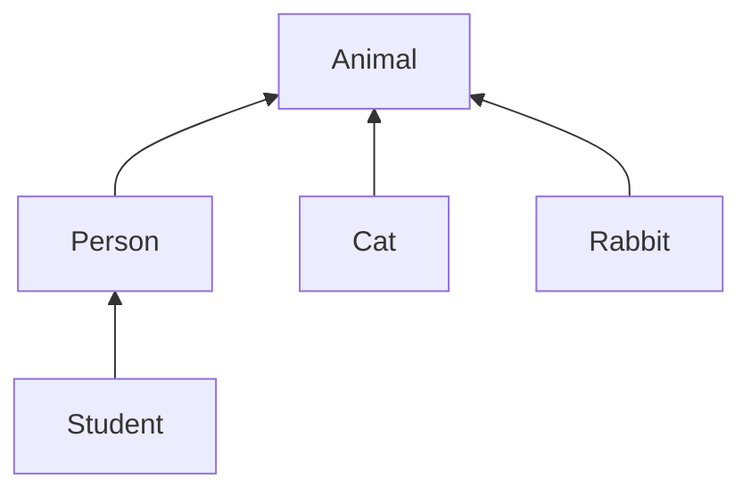

---

title: Introduction to Computer Science and Programming Using Python(5)

key: B20181202

tags: class; instances; methods 

layout: article
---

<!--more-->

# Week Five: Object Oriented Programming

## 1. Object Oriented Programming


## 2. Class,Instances,Method

- [**Object Oriented Programming: Classes and Instances**](https://courses.edx.org/courses/course-v1:MITx+6.00.1x+2T2018/discussion/forum/2208572aadd1aa385ed0023d71714e6fb8a71626/threads/5bb66b9fb41e6e084f000161)

- **Method:**procedural attribute, like a function that works only with this class. [**Object Oriented Programming: Methods**](https://courses.edx.org/courses/course-v1:MITx+6.00.1x+2T2018/discussion/forum/2208572aadd1aa385ed0023d71714e6fb8a71626/threads/5bb66d09fb45b2080c000167)

- ```python
  class Coordinate(object):
      def __init__(self, x, y):
          self.x = x
          self.y = y
      def distance(self, other):
          x_diff_sq = (self.x - other.x)**2
          y_diff_sq = (self.y - other.y) ** 2
          return (x_diff_sq + y_diff_sq)** 0.5
      def __str__(self): #print()打印函数
          return "I am glad to see you！"
  ```

- Special Operators：[**Basic Customization**](https://docs.python.org/3/reference/datamodel.html#basic-customization)

- Example 1:**Fraction**

  ```python
  ​```
  # two intergers: numerator;denominator
  # goals: 1.print representation; 2. add,subtract; 3. convert to a float
  ​```
  class fraction(object):
      def __init__(self, numer, denom):
          self.numer = numer
          self.denom = denom
      def __str__(self):
          return str(self.numer) + ' / ' + str(self.denom)
      def getNumer(self):
          return self.numer
      def getDenom(self):
          return self.denom
      def __add__(self, other):
          numerNew = other.getDenom() * self.getNumer() \
                     + other.getNumer() * self.getDenom()
          denomNew = other.getDenom() * self.getDenom()
          return fraction(numerNew, denomNew)
      def __sub__(self, other):
          numerNew = other.getDenom() * self.getNumer() \
                     - other.getNumer() * self.getDenom()
          denomNew = other.getDenom() * self.getDenom()
          return fraction(numerNew, denomNew)
      def convert(self):
          return self.getNumer() / self.getDenom()
  ```

- Example 2: **A set of integers**

  ```python
  ​```
  # a collection of integers
  # a particular integer appears only once in a set
  ​```
  
  ```


​     

## 3. Hierachies 




