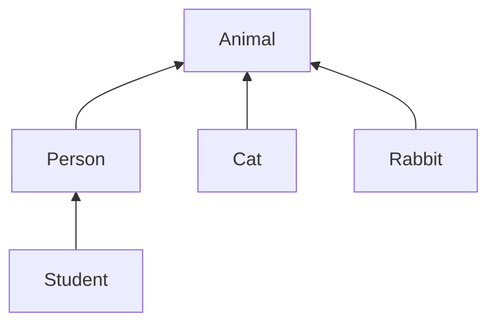

---

title: Introduction to Computer Science and Programming Using Python(5)

key: B20181202

tags: class; instances; methods 

layout: article
---

# Week Five: Object Oriented Programming

<!--more-->

## 1. Object Oriented Programming


## 2. Class,Instances,Method

- [**Object Oriented Programming: Classes and Instances**](https://courses.edx.org/courses/course-v1:MITx+6.00.1x+2T2018/discussion/forum/2208572aadd1aa385ed0023d71714e6fb8a71626/threads/5bb66b9fb41e6e084f000161)

  - **it provides the blueprint to create individual instances that share the same structure but have their own set of characteristics**

  - | class            | methods                                    | instance   | object               | type             |
    | ---------------- | ------------------------------------------ | ---------- | -------------------- | ---------------- |
    | 集合（抽象概念） | 集合属性/参数/动作                         | 具体例子   | 所有实体             | 实体概念概念归属 |
    | House            | house attributs: bedrooms,  gardens, price | your house | bricks, woods, beams | 硬装，水电，家具 |

  1. What is Class?

     

  2. __init__

     

  3. instance

     

     

     

  4. You are an example

     

- **Method:**procedural attribute, like a function that works only with this class. [**Object Oriented Programming: Methods**](https://courses.edx.org/courses/course-v1:MITx+6.00.1x+2T2018/discussion/forum/2208572aadd1aa385ed0023d71714e6fb8a71626/threads/5bb66d09fb45b2080c000167)

  - What are methods?

    

  - How to call methods?

    

- ```python
  class Coordinate(object):
      def __init__(self, x, y):
          self.x = x
          self.y = y
      def distance(self, other):
          x_diff_sq = (self.x - other.x)**2
          y_diff_sq = (self.y - other.y) ** 2
          return (x_diff_sq + y_diff_sq)** 0.5
      def __str__(self): #print()打印函数
          return "I am glad to see you！"
  ```

- Special Operators：[**Basic Customization**](https://docs.python.org/3/reference/datamodel.html#basic-customization)

- Example 1:**Fraction**

  ```python
  ​```
  # two intergers: numerator;denominator
  # goals: 1.print representation; 2. add,subtract; 3. convert to a float
  ​```
  class fraction(object):
      def __init__(self, numer, denom):
          self.numer = numer
          self.denom = denom
      def __str__(self):
          return str(self.numer) + ' / ' + str(self.denom)
      def getNumer(self):
          return self.numer
      def getDenom(self):
          return self.denom
      def __add__(self, other):
          numerNew = other.getDenom() * self.getNumer() \
                     + other.getNumer() * self.getDenom()
          denomNew = other.getDenom() * self.getDenom()
          return fraction(numerNew, denomNew)
      def __sub__(self, other):
          numerNew = other.getDenom() * self.getNumer() \
                     - other.getNumer() * self.getDenom()
          denomNew = other.getDenom() * self.getDenom()
          return fraction(numerNew, denomNew)
      def convert(self):
          return self.getNumer() / self.getDenom()
  ```

- Example 2: **A set of integers**

  ```python
  ​```
  # a collection of integers
  # a particular integer appears only once in a set
  ​```
  
  ```


​     

## 3. Hierarchies 




## 4. Generators

**Generators**: any procedure or method with `yield` statement called a generator.


```python
def genFib():
    fibn_1 = 1
    fibn_2 = 0
    while True:
        next = fibn_1 + fibn_2
        yield next #相当于range的功能
        fibn_2 = fibn_1
        fibn_1 = next

        
>>> fib = genFib()
>>> fib.__next__()
1
>>> fib.__next__()
2
>>> fib.__next__()
3
>>> fib.__next__()
5
>>> fib.__next__()
8
>>> fib.__next__()
13
        
```

